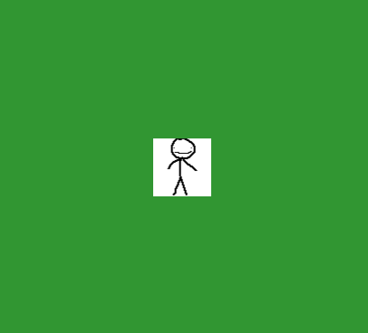

# Lesson 2 – Graphics and Input


> *"Wanna sprite cranberry?"*  
> – **Lebron James**

---

## Concepts

- Rendering basics
- Sprite management
- Input polling
- Event-driven systems

---

## Drawing to the Screen

### Render pipeline

Unlike complete game engines where we get this premade for us, we have to manually manage all textures ourselves.
That means loading files, declaring textures to render, where to place them on the screen, preform any modifications, and finally presenting the backbuffer.

<details>
<summary>renderingloop</summary>

 ```cpp
#include <SDL3/SDL.h>
#include <SDL3/SDL_image.h>

int main(int argc, char** argv) {
    SDL_Init(SDL_INIT_VIDEO | SDL_INIT_GAMEPAD);
    SDL_Window* win = SDL_CreateWindow("SDL3 Demo",800, 600, 0);
    SDL_Renderer* ren = SDL_CreateRenderer(win, NULL);

    bool running = true;
    SDL_Event ev;

    while (running) {
        //Event handling
        while (SDL_PollEvent(&ev)) {
            if (ev.key.key == SDLK_ESCAPE) {
                running = false;
            }
        }

        //clear last frame
        SDL_RenderClear(ren);

        // draw calls
        
        //make rect to render sprite into
        SDL_FRect* dst = new SDL_FRect{ 100,100,64,64 };
        SDL_RenderTexture(ren, sprite, NULL, dst);

        SDL_RenderPresent(ren);
    }

    SDL_DestroyRenderer(ren);
    SDL_DestroyWindow(win);
    SDL_Quit();
    return 0;
}

```
</details>

In this example, we never actually move or modify the sprite in anyway, so we would get the same result if we only rendered once.

---

### Managing textures

It's not enough to just show a sprite, we need to know how to mess with it a bit.
We can obviously move the location by tweaking the x & y values on the FRect.

SDL_FRect{x, y, 64, 64}

----

### Sprite clipping and stretching

The same goes for the scale, just tweak the w and h components of the struct.

SDL_FRect{100, 100, w, h}

We can also partially render our sprite on the rect by specifying a source rect on the selected texture.
Imagine it as a rect place over the selected texture as a mask.
<table>
  <tr>
    <td  width="50%"></td>
    <td  width="50%"></td>
  </tr>
</table>

sourcerect = SDL_FRect{0, 0, 32, 64}

(This is how we will be splitting sprite maps)

### Color keying for transparancy

----

If we want to key a part of our surface, for transparency we use the SDL_Surface struct and map some color values.

<details>
<summary>transparency</summary>

 ```cpp
SDL_Surface* surf = IMG_Load("player.bmp");
//yeet all color
SDL_SetSurfaceColorKey(surf, true, SDL_MapSurfaceRGB(surf, 255, 255, 255)) == false;
//new texture from modified surface
SDL_Texture* keyed = SDL_CreateTextureFromSurface(ren, surf);
//overwrite sprite
sprite = SDL_CreateTextureFromSurface(ren, surf);
//free memory
SDL_DestroySurface(surf);

```
</details>

In this example, since we use a bitmap, we use SetSurfaceColorKey false with MapSurfaceRGB set to white to remove the sprite background.
We could also flip it and key out the black pixels.

<table>
  <tr>
    <td  width="50%"></td>
    <td  width="50%"></td>
  </tr>
</table>

----

### Rotation

If we need to rotate our sprite we use RenderTextureRotated, we cna also flip our sprite with supplied params.
We obviously have to make it spinso we will increment the angle param overtime B).

SDL_RenderTextureRotated(ren, sprite, NULL, dst, angle, NULL, SDL_FLIP_NONE);


---

## Handling Input

### Polling vs Events
Polling for when we need an immediate check, events for when we don't.
Events are pushed into the SDL_PollEvent queue, and polling has to be manually called.
Don't foget to call SDL_PumpEvents(); to execute the checks.

<details>
<summary>Polling Example</summary>

 ```cpp
        // Polling
        const bool* keys = SDL_GetKeyboardState(NULL);
        SDL_PumpEvents();


        //move sprite
        xMove = 0;
        yMove = 0;


        if (keys[SDL_SCANCODE_W])
            yMove = -1;
        if (keys[SDL_SCANCODE_A])
            xMove = -1;
        if (keys[SDL_SCANCODE_S])
            yMove = 1;
        if (keys[SDL_SCANCODE_D])
            xMove = 1;

        xPos += xMove * moveScale;
        yPos += yMove * moveScale;

        //clear last frame
        SDL_RenderClear(ren);


        // draw calls
        
        //make rect to render sprite into
        SDL_FRect* dst = new SDL_FRect{ xPos, yPos, 64,64 };

```
</details>
<details>
<summary>Event Example</summary>

 ```cpp

  //Event handling
  while (SDL_PollEvent(&ev)) {
      if (ev.key.key == SDLK_ESCAPE) {
          running = false;
      }
  }
```
</details>

### Keyboard & Mouse

The process is the same as for keyboard, but with other function calls.

<details>
<summary>Mouse Event Example</summary>

 ```cpp

  //Event handling
while (SDL_PollEvent(&ev)) {

    //mouse events example
    if (ev.type = SDL_EVENT_MOUSE_BUTTON_DOWN) {
        bool left = ev.button.down == SDL_BUTTON_LEFT;
        bool right = ev.button.down == SDL_BUTTON_RIGHT;
        //dosomething(left, right);
    }
    if (ev.type = SDL_EVENT_MOUSE_MOTION) {
        float x = ev.motion.x;
    }
}
```
</details>
<details>
<summary>Mouse Polling Example</summary>

 ```cpp        
        //mouse
        float* x = 0; 
        float* y = 0;
        SDL_MouseButtonFlags mbFlags = 0;
        mbFlags = SDL_GetMouseState(x, y);

        SDL_PumpEvents();

        //mouse click example
        if (mbFlags & SDL_BUTTON_MASK(SDL_BUTTON_LEFT))
            xMove = 1;
```
</details>

### Gamepads / Joysticks

Not much more to add, except needing to initialize the gamepad system.

<details>
<summary>Gamepad Polling Example</summary>

 ```cpp
    SDL_Init(SDL_INIT_VIDEO | SDL_INIT_GAMEPAD);
    SDL_Gamepad* gamepad = SDL_OpenGamepad(0);

        //gamepad
        Sint16 gamepadAxisX = 0;
        if (gamepad)
            gamepadAxisX = SDL_GetGamepadAxis(gamepad, SDL_GAMEPAD_AXIS_LEFTX);

        SDL_PumpEvents();

        //gamepad example
        if (gamepadAxisX > 0)
            xMove = 1;
```
</details>
<details>
<summary>Gamepad Event Example</summary>

 ```cpp
     if (ev.type == SDL_EVENT_GAMEPAD_AXIS_MOTION) {
         
         if (ev.gaxis.axis == SDL_GAMEPAD_AXIS_LEFTX) {
             //do something :^)
         }
     }
```
</details>


---

## Very Optional Assignment B)

Make the lil' sprite move.



Or try and make sense of make code example below. (cheat)

---
## Code Example

<details>
<summary>main.cpp</summary>

```cpp

#include <SDL3/SDL.h>
#include <SDL3/SDL_image.h>

int main(int argc, char** argv) {
    SDL_Init(SDL_INIT_VIDEO | SDL_INIT_GAMEPAD);
    SDL_Window* win = SDL_CreateWindow("SDL3 Demo",800, 600, 0);
    SDL_Renderer* ren = SDL_CreateRenderer(win, NULL);

    SDL_Gamepad* gamepad = SDL_OpenGamepad(0);

    //background color
    SDL_SetRenderDrawColor(ren, 50, 150, 50, 255);

    //cool sprite
    SDL_Texture* sprite = IMG_LoadTexture(ren, "player.bmp");
    float xPos = 100, yPos = 100;
    int xMove = 0, yMove = 0;
    float moveScale = .01f;

    //tranparency
    //SDL_Surface* surf = IMG_Load("player.bmp");
    ////yeet all color
    //SDL_SetSurfaceColorKey(surf, true, SDL_MapSurfaceRGB(surf, 255, 255, 255)) == false;
    ////new texture from modified surface
    //SDL_Texture* keyed = SDL_CreateTextureFromSurface(ren, surf);
    ////overwrite sprite
    //sprite = SDL_CreateTextureFromSurface(ren, surf);
    ////free memory
    //SDL_DestroySurface(surf);

    //funny spin
    //double angle = 0;

    bool running = true;
    SDL_Event ev;

    while (running) {

        //Event handling
        while (SDL_PollEvent(&ev)) {
            if (ev.key.key == SDLK_ESCAPE) {
                running = false;
            }
            //if (ev.type == SDL_EVENT_GAMEPAD_AXIS_MOTION) {
            //    
            //    if (ev.gaxis.axis == SDL_GAMEPAD_AXIS_LEFTX) {
            //        //do something :^)
            //    }
            //}

            ////mouse events example
            //if (ev.type = SDL_EVENT_MOUSE_BUTTON_DOWN) {
            //    bool left = ev.button.down == SDL_BUTTON_LEFT;
            //    bool right = ev.button.down == SDL_BUTTON_RIGHT;
            //    //dosomething(left, right);
            //}
            //if (ev.type = SDL_EVENT_MOUSE_MOTION) {
            //    float x = ev.motion.x;
            //}

        }
        
        //mouse
        //float* x = 0; 
        //float* y = 0;
        //SDL_MouseButtonFlags mbFlags = 0;
        //mbFlags = SDL_GetMouseState(x, y);

        ////gamepad
        //Sint16 gamepadAxisX = 0;
        //if (gamepad)
        //    gamepadAxisX = SDL_GetGamepadAxis(gamepad, SDL_GAMEPAD_AXIS_LEFTX);


        // Polling
        const bool* keys = SDL_GetKeyboardState(NULL);
        SDL_PumpEvents();


        //move sprite
        xMove = 0;
        yMove = 0;

        //mouse click example
        //if (mbFlags & SDL_BUTTON_MASK(SDL_BUTTON_LEFT))
        //    xMove = 1;
        ////gamepad example
        //if (gamepadAxisX > 0)
        //    xMove = 1;

        if (keys[SDL_SCANCODE_W])
            yMove = -1;
        if (keys[SDL_SCANCODE_A])
            xMove = -1;
        if (keys[SDL_SCANCODE_S])
            yMove = 1;
        if (keys[SDL_SCANCODE_D])
            xMove = 1;

        xPos += xMove * moveScale;
        yPos += yMove * moveScale;

        //clear last frame
        SDL_RenderClear(ren);


        // draw calls
        
        //make rect to render sprite into
        SDL_FRect* dst = new SDL_FRect{ xPos, yPos, 64,64 };

        //scretch the rendering rect
        //dst->w *= 2;
        
        //clip, draw only part of texture on rect
        //SDL_RenderTexture(ren, sprite, new SDL_FRect{ 0,0, 32, 64 }, dst);
        
        //rotated
        /*angle += .01;
        SDL_RenderTextureRotated(ren, sprite, NULL, dst, angle, NULL, SDL_FLIP_NONE);*/

        //normal render
        SDL_RenderTexture(ren, sprite, NULL, dst);


        SDL_RenderPresent(ren);
    }

    SDL_DestroyRenderer(ren);
    SDL_DestroyWindow(win);
    SDL_Quit();
    return 0;
}

