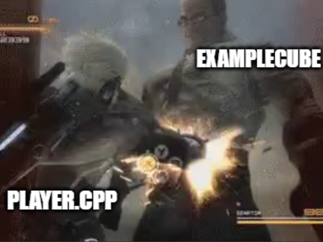
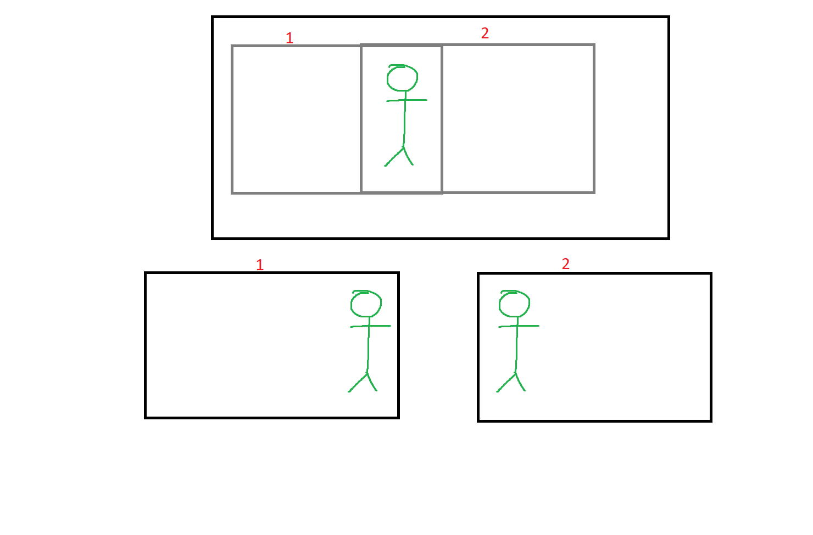

# Lesson 4 – Collision Detection, Camera Movement & Audio Playback

---

## Concepts

- Axis-Aligned Bounding Boxes (AABB)
- Viewport and camera transforms
- SDL_mixer for audio playback

---

## Collision Detection

### Bounding boxes

The most basic form of collision detection is comparing two hitboxes against eachother.
A "separating angles test" between two axis aligned bounding boxes (AABB).
In caveman terms: look at squares. one square overlap other squar. no ):< 

We'll add an intersection test to our example cube and check.

<details>
<summary>Examplecube.h</summary>

 ```cpp

class ExampleCube : public GameObject {
public:
	ExampleCube(SDL_Renderer* renderer, int x, int y, int w, int h, SDL_Texture* texture) : GameObject(renderer, x, y, w, h, texture) {	};
	~ExampleCube() {};


	virtual void Update(float DeltaTime, float ScaledDeltaTime) override;
	virtual void Render() override;

	bool Intersects(const SDL_FRect& other) const {

		bool noOverlap =
			rect.x + rect.w <= other.x ||  //left of other
			other.x + other.w <= rect.x || //right of other
			rect.y + rect.h <= other.y ||  //above other
			other.y + other.h <= rect.y;   //is below other

		return !noOverlap;
	}

```
</details>

We can now check an input rect against it and determine if the overlap.
Notice the const keywords, theese show the compilera that we will *not* be modifying the statement following it.
Since we're working with pointers and references this is a form of extra safety and is good for readability.

### Resolving Collisions

Where do we use this new and fancy intersection check? Depending on how overkill you want to make your collision system, the answer can vary from "three inheritance layers deep in an intricate, layered physics manager" to "no".
For this example we'll settle by shoving it directly into our player class.
Nothing wrong with this, but if you're used to game engines, this feels kinda yucky.

<details>
<summary>Player.cpp</summary>

 ```cpp
void Player::Update(float DeltaTime, float ScaledDeltaTime)
{
    GameObject::Update(DeltaTime, ScaledDeltaTime);

    float speed = 7.f;

    if (InputManager::IsKeyDown(SDL_SCANCODE_W))
        Move(0, -speed, *ExampleObstacle);
    if (InputManager::IsKeyDown(SDL_SCANCODE_S)) 
        Move(0, speed, *ExampleObstacle);
    if (InputManager::IsKeyDown(SDL_SCANCODE_A)) 
        Move(-speed, 0, *ExampleObstacle);
    if (InputManager::IsKeyDown(SDL_SCANCODE_D)) 
        Move(speed, 0, *ExampleObstacle);
        

}

void Player::Move(float dX, float dY, const ExampleCube& exCube)
{
    //moving in X
    rect.x += dX;
    if (exCube.Intersects(rect)) {
        if (dX > 0) { //moving right
            rect.x = exCube.rect.x - rect.w;
        }
        else if (dX < 0) { //moving left
            rect.x = exCube.rect.x + exCube.rect.w;
        }
    }
    //moving in Y
    rect.y += dY;
    if (exCube.Intersects(rect)) {
        if (dY > 0) { //moving down
            rect.y = exCube.rect.y - rect.h;
        }
        else if (dY < 0) { //moving up
            rect.y = exCube.rect.y + exCube.rect.h;
        }
    }
}


```
</details>

What we're doing here is after shifting our react with the movement input,
check against our referenced example obstacle, and if overlapping, shove our rect back to where it came from.




## Camera

Making a camera is actually just about modifying the rendered rect before displaying it, imagine a rect within a rect, the inner one being the camera view.
Rendering the game world under this rect is the same as shifting the objects in the world by the cameras coordinates.



### Camera class

We start by making new camera class, for this example we wont bother with resolution, we're just demoing how the camera works.
We will save a camera instance, and pass it into our game.render function, since we do our rendering logic on the gameobject level.

<details>
<summary>Camera.cpp</summary>

 ```cpp

#pragma once

#include <SDL3/SDL.h>

class Camera {
public:
    Camera(float x, float y)
        : x(x), y(y) {}

    void Move(float dx, float dy) {
        x += dx;
        y += dy;
    }
    SDL_FRect WorldToScreen(const SDL_FRect& worldRect) const {
        return {
            worldRect.x - x,
            worldRect.y - y,
            worldRect.w,
            worldRect.h
        };
    }

private:
    float x, y;
};


```
</details>
<details>
<summary>Camera.cpp</summary>

 ```cpp


void GameObject::Render(const Camera& cam) {

    SDL_FRect screenRect = cam.worldToScreen(rect);

    if (texture)
        SDL_RenderTexture(renderer, texture, NULL, &screenRect);
    else
        SDL_RenderFillRect(renderer, &screenRect);
}


```
</details>

All our gameobject will now be offset by our camera position while rendering, while still retaining thier real worldposition, logically.

## Audio Playback

In order to play audio we need another plugin, just like SDL_image. If you have stolen the precompiled libraries from lesson one, all that's needed is adding the header in the #includes.
As of writing this, the SDL_mixer addon is still very much in development, thus, it might be a bit problematic to find good sources.
My best advice is to trust your gut feeling and read the internal documentation in the header file.

## SFX

Current objective: play audio.
We will do this by creating a new audioplayer class, initalizing mixers, defining load and play logic, and hooking into to our main file.
<details>
<summary>AudioPlayer.cpp</summary>

 ```cpp


#include "AudioPlayer.h"

bool AudioPlayer::Init() {
    if (!SDL_InitSubSystem(SDL_INIT_AUDIO)) {
        std::cerr << "SDL_InitSubSystem failed: " << SDL_GetError() << "\n";
        return false;
    }
    if (!MIX_Init()) {
        std::cerr << "MIX_Init failed: " << SDL_GetError() << "\n";
        return false;
    }
    mixer = MIX_CreateMixerDevice(SDL_AUDIO_DEVICE_DEFAULT_PLAYBACK, new SDL_AudioSpec{ SDL_AudioFormat::SDL_AUDIO_F32,1,44100 });
    if (!mixer) {
        std::cerr << "MIX_CreateMixerDevice failed: " << SDL_GetError() << "\n";
        return false;
    }
    return true;
}
/// <summary>
/// load file at path to memory
/// </summary>
/// <param name="path"></param>
/// <returns></returns>
bool AudioPlayer::Load(const std::string& path) {
    Free();
    audioData = MIX_LoadAudio(mixer, path.c_str(), false);
    if (!audioData) {
        std::cerr << "MIX_LoadAudio failed: " << SDL_GetError() << "\n";
        return false;
    }
    return true;
}
/// <summary>
/// play loaded file
/// </summary>
/// <param name="loop"></param>
void AudioPlayer::Play(bool loop = false) {
    if (!mixer || !audioData) return;

    track = MIX_CreateTrack(mixer);
    if (!track) {
        std::cerr << "MIX_CreateTrack failed: " << SDL_GetError() << "\n";
        return;
    }

    if (!MIX_SetTrackAudio(track, audioData)) {
        std::cerr << "MIX_SetTrackAudio failed: " << SDL_GetError() << "\n";
        return;
    }

    // loop = -1 for infinite, or 0 for once
    if (!MIX_PlayTrack(track, loop ? -1 : 0)) {
        std::cerr << "MIX_PlayTrack failed: " << SDL_GetError() << "\n";
    }
}

void AudioPlayer::Stop() {
    if (track) {
        MIX_StopTrack(track, 0);
        track = 0;
    }
}
/// <summary>
/// free memory
/// </summary>
void AudioPlayer::Free() {
    if (audioData) {
        MIX_DestroyAudio(audioData);
        audioData = nullptr;
    }
}

void AudioPlayer::Quit() {
    Stop();
    Free();
    if (mixer) {
        MIX_DestroyMixer(mixer);
        mixer = nullptr;
    }
    MIX_Quit();
    SDL_QuitSubSystem(SDL_INIT_AUDIO);
}


```
</details>

Like all subsystems with need to initialize it before we can use it. This time we'll do it selfcontained in the audioplayer class.
In order to play audio we need a mixer and a track. The mixer is responsible for sending the output to the audio device, and the track is what loads the individual files
In our main.cpp, we will construct and init our audio player, load an audio file from our project folder, and then we can play it.
Don't forget to call AudioPlyaer::Quit() when closing the program.

<details>
<summary>Camera.cpp</summary>

 ```cpp


AudioPlayer AudioP;
}
if (!AudioP.Init())
    return -1;

if (!AudioP.Load("Bell.wav"))
	AudioP.Play();


```
</details>
