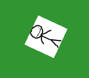

# Lesson 2 – Graphics and Input

---

## Intro

---

## Key Concepts

- Rendering basics
- Sprite management
- Input polling
- Event-driven systems

---

## Drawing to the Screen

### Render pipeline

Unlike complete game engines where we get premade for us, we have to manually manage all textures ourselves.
That means loading files, declaring textures to render, where to place them on the screen, preform any modifications, and finally presenting the backbuffer.

<details>
<summary>renderingloop</summary>

 ```cpp
#include <SDL3/SDL.h>
#include <SDL3/SDL_image.h>

int main(int argc, char** argv) {
    SDL_Init(SDL_INIT_VIDEO | SDL_INIT_GAMEPAD);
    SDL_Window* win = SDL_CreateWindow("SDL3 Demo",800, 600, 0);
    SDL_Renderer* ren = SDL_CreateRenderer(win, NULL);

    bool running = true;
    SDL_Event ev;

    while (running) {
        //Event handling
        while (SDL_PollEvent(&ev)) {
            if (ev.key.key == SDLK_ESCAPE) {
                running = false;
            }
        }

        //clear last frame
        SDL_RenderClear(ren);

        // draw calls
        
        //make rect to render sprite into
        SDL_FRect* dst = new SDL_FRect{ 100,100,64,64 };
        SDL_RenderTexture(ren, sprite, NULL, dst);

        SDL_RenderPresent(ren);
    }

    SDL_DestroyRenderer(ren);
    SDL_DestroyWindow(win);
    SDL_Quit();
    return 0;
}

```
</details>

In this example, we never actually move or modify the sprite in anyway, so we would get the same result if we only rendered once.

---

### Managing textures

Its not enough to just show a sprite, we need to know how to mess with it a bit.
We can obviously move the location by tweaking the x & y values on the FRect.

SDL_FRect{x, y, 64, 64}

----

### Sprite clipping and stretching

The same goes for the scale, just tweak the w and h components of the struct.

SDL_FRect{100, 100, w, h}

We can also partially render our sprite on the rect by specifying a source rect on the selected texture.
Imagine it as a rect place over the selected texture as a mask.
<table>
  <tr>
    <td  width="50%"></td>
    <td  width="50%"></td>
  </tr>
</table>

sourcerect = SDL_FRect{0, 0, 32, 64}

(This is how we will be splitting sprite maps)

### Color keying for transparancy

----

If we want to key a part of our surface, for transparency we use the SDL_Surface struct and map some color values.

<details>
<summary>transparency</summary>

 ```cpp
SDL_Surface* surf = IMG_Load("player.bmp");
//yeet all color
SDL_SetSurfaceColorKey(surf, true, SDL_MapSurfaceRGB(surf, 255, 255, 255)) == false;
//new texture from modified surface
SDL_Texture* keyed = SDL_CreateTextureFromSurface(ren, surf);
//overwrite sprite
sprite = SDL_CreateTextureFromSurface(ren, surf);
//free memory
SDL_DestroySurface(surf);

```
</details>

In this example, since we use a bitmap, we use SetSurfaceColorKey false with MapSurfaceRGB set to white to remove the sprite background.
We could also flip it and key out the black pixels.

<table>
  <tr>
    <td  width="50%"></td>
    <td  width="50%"></td>
  </tr>
</table>

----

### Rotation

If we need to rotate our sprite we use RenderTextureRotated, we cna also flip our sprite with supplied params.
We obviously have to make it spinso we will increment the angle param overtime B).

SDL_RenderTextureRotated(ren, sprite, NULL, dst, angle, NULL, SDL_FLIP_NONE);



---

## Handling Input

### Keyboard & Mouse

### Gamepads / Joysticks

### Polling vs Events

---

## Code Example

<details>
<summary>main.cpp</summary>

```cpp
// Paste your SDL3 code sample here

