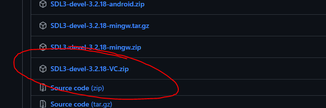
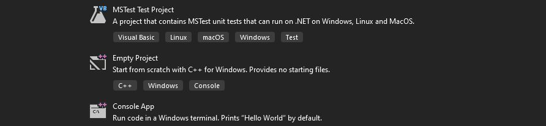
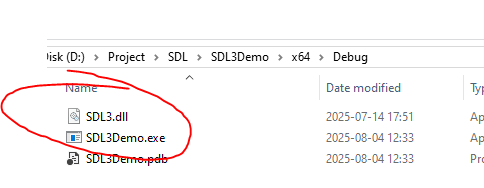

# Lesson 01 – Introduction to SDL3


> *"If they can't make their own game engine, they are not programmers."*  
> – **Notch**

---

## Wth Is SDL3?

Simple DirectMedia Layer is a library made to provide access to hardware components.
For our purposes, a tool to skip the boring parts of making a game engine.

- Open source, in C
- Native support for C++
- Other languages we don't care about for now

*Features include but not limited too*:
- Graphics Rendering
- Audio Playback
- Input Handling
- Multithreading & Timers
- Netwworking (We'll skip this, but its here)
- Extentions/Plugins
- Headaches
- Making you a pro coder

---

## Changes from SDL2

A bunch of architectural changes, header restructuring, and other things we don't need to think about.

#### The key takeaway:

Double check wether the youtube tutorial is made for the new version before wasting 3 hours of your life debugging and getting shamed in the video comments

---

## SDL3 vs. Game Engines

This is like comparing a car to a warehouse of parts.
Cringe game engine user vs chad game engine developer.

#### You get to:
- Rarely blame anyone but yourself for your bugs
- Find a burst slight of joy when progress is made
- Learn to downscope harder than ever before
- Sit at the grown up table

### Actual points to consider:
- Skip hidden black box logic
- Decide the game loops yourself
- Preformant af
- Knowing how a game engine works obviously makes you better at using one (skilldif)

---

## Cool things you'll learn

- C++ syntax
- Manual resource management  
- Rendering and audio pipelines  

----

# Let's get grinding

## Setup Guide

The [official setup](https://github.com/libsdl-org/SDL/blob/main/docs/INTRO-visualstudio.md) is a bit missleading and does not go over everything needed,
stick to this page to avoid an extra headache.

### Prerequisites

- Visual Studio
- An internet connection
  
### Installing SDL3

1. Get the [SourceCode](https://github.com/libsdl-org/SDL/releases/latest) make sure to pick SDL3-devel-(verision)-VC.zip

2. Create a new empty vs project

3. Create a new main.cpp file and paste in a complete AI generated game, alt. the example below.
<details>
<summary>main.cpp</summary>

 ```cpp
#include <SDL3/SDL.h>
#include <iostream>

int main(int argc, char* argv[]) {

    //Init SDL core
    if (!SDL_Init(SDL_INIT_VIDEO)) {
        std::cerr << "SDL Init Failed: " << SDL_GetError() << '\n';
        return 0;
    }

    //Cool window
    SDL_Window* window = SDL_CreateWindow("WINDOW_TITLE", 800, 600, 0);
    //lovely error handling
    if (!window) {
       
        std::cerr << "Window Creation Failed: " << SDL_GetError() << '\n';
        SDL_Quit();
        return 0;
    }

    //temp input check to close the window
    bool running = true;
    SDL_Event event;
    while (running) {
        while (SDL_PollEvent(&event)) {
            switch (event.type) {
            case SDL_EVENT_QUIT:
                running = false;
                break;
            case SDL_EVENT_KEY_DOWN:
                if (event.key.key == SDLK_ESCAPE)
                    running = false;
                break;
            default:
                break;
            }
        }
    }

    //Clean
    SDL_DestroyWindow(window);
    SDL_Quit();
    return 0;
}

```
</details>

4. Link the following SDL files to the additional include directories and dependancies.
<table>
  <tr>
    <td  width="33%"></td>
    <td  width="33%"></td>
    <td  width="33%"></td>
  </tr>
</table>

5. Clone the SDL.dll from SDL/lib/x64 to 'ProjectName'/x64/Debug


6. Build and run B)
   
---

## Adding Extentions


## What’s Next

- **Lesson 2**: Graphics and input 
- **Lesson 3**: Collision and timers
- **Lesson 4**:  Camera, Audio & files

---

## References & Resources

- [Official SDL3 Documentation](https://wiki.libsdl.org/)  
- [SDL3 GitHub Repository](https://github.com/libsdl-org/SDL)
- Write to an LLM
